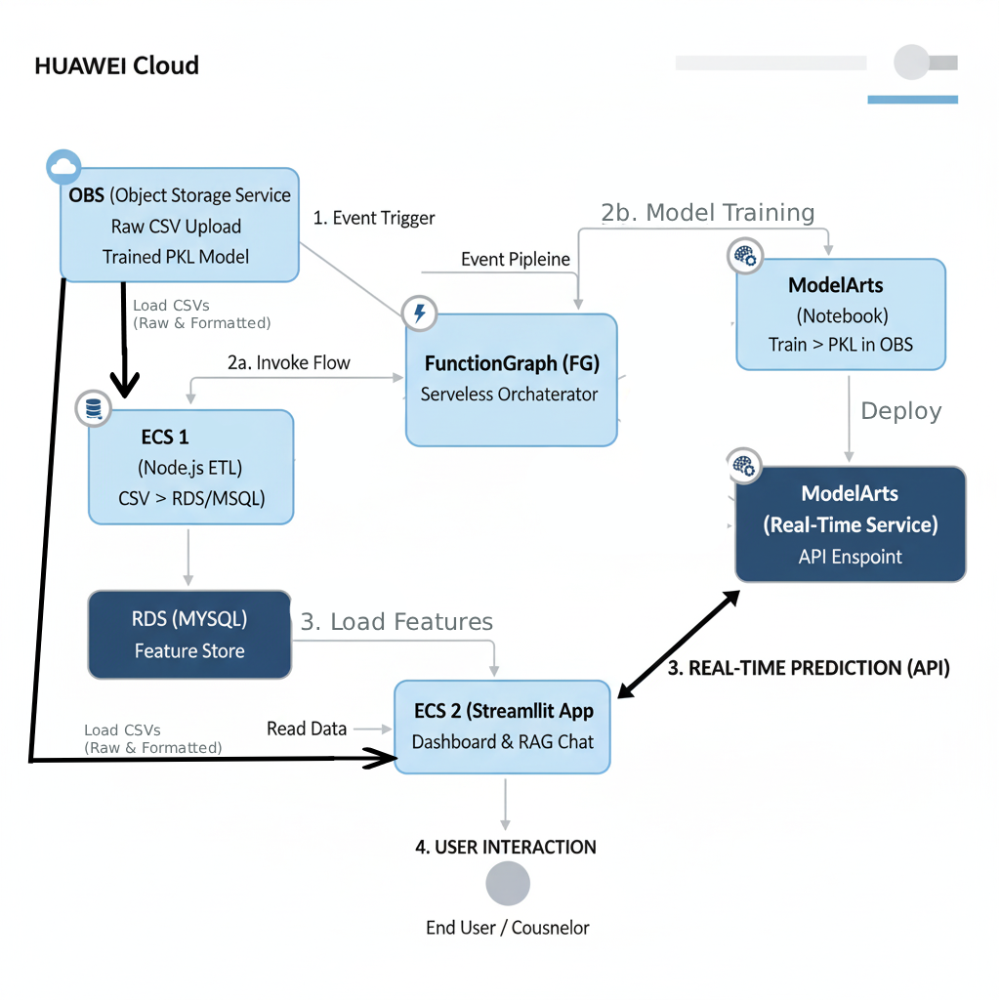

## 📝 README: AI-Powered Student Retention System

# 🎓 AI-Powered Student Retention System: MLOps with Generative AI

**Tags:** **AI Counselor Chat (RAG)**, **Student Churn Prediction**, **Real-Time Inference**, **MLOps**, **Event-Driven Architecture**, **Huawei Cloud**, **Decision Support System**

---

## 1. Project Overview

The **AI-Powered Student Retention System** is a sophisticated Machine Learning Operations (MLOps) solution built entirely on the **Huawei Cloud** platform. Its primary goal is to minimize student attrition by predicting dropout risk and providing counselors with personalized, actionable intervention advice. The system achieves high efficiency through a fully **event-driven architecture**, ensuring model training and deployment are immediate responses to new data. By integrating a **Real-Time Prediction Service** with a **Generative AI (RAG) system**, the project transforms raw data into a powerful, proactive **decision support system**.

---

## 2. Key Innovations

This project introduces several core innovations that move it beyond standard predictive analytics:

* **AI Counselor Chat (RAG):** The flagship feature, powered by **Gemini**. It uses **Retrieval-Augmented Generation (RAG)** to synthesize the predicted risk score with the student's full profile, generating nuanced, conversational, and policy-aware retention strategies, acting as a virtual assistant for counselors.
* **Zero-Touch Event-Driven Pipeline:** The entire pipeline, from data ingestion to model deployment, is automated using the **OBS $\to$ FunctionGraph (FG)** sequence. This ensures minimal human intervention, rapid model iteration, and high operational efficiency.
* **Real-Time Decoupled Inference:** The churn model is deployed as a scalable **ModelArts Real-Time Service API Endpoint**. This allows the Streamlit app to request **low-latency predictions** via API, ensuring scalability and consistency with the production model version.
* **RDS as Dynamic Feature Store:** **RDS (MySQL)** is utilized to host standardized, engineered features (e.g., `First_sem_pass_rate` from `02_feature_extraction.sql`), ensuring feature consistency between model training and real-time inference.

---

## 3. Technical Architecture

The architecture is a cohesive, fully managed MLOps pipeline on Huawei Cloud services.

### Architecture Diagram

!(Architecture.png)

### Huawei Cloud Components

| Service | Role in Project |
| :--- | :--- |
| **OBS (Object Storage Service)** | Data Lake, Source for CSV data and trained Model/Scaler Artifacts. |
| **FunctionGraph (FG)** | Serverless orchestrator; triggers parallel ETL and training workflows based on OBS events. |
| **ECS (Elastic Cloud Server)** | Hosts the Node.js ETL application (ECS 1) and the Streamlit web application (ECS 2). |
| **RDS (Relational Database Service)** | Structured Feature Store for standardized data and application reporting. |
| **ModelArts** | Managed environment for model training and deployment of the high-availability Real-Time Prediction Service. |

---

## 4. Business Value

This system delivers measurable value by:

1.  **Direct Revenue Impact:** Maximizes student retention through timely, targeted intervention, saving tuition income.
2.  **Operational Efficiency:** Optimizes staff resources by allowing counselors to prioritize the highest-risk students identified by the real-time prediction model.
3.  **Strategic Insight:** Provides data-backed insights from the RDS Feature Store to inform and adjust institutional policies and support services.

--

## 5. Architecture Diagram

